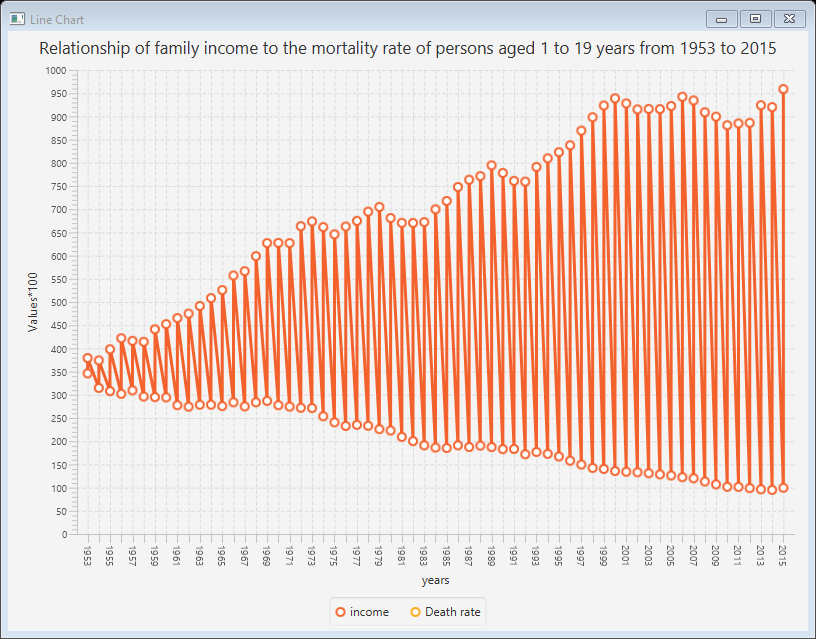
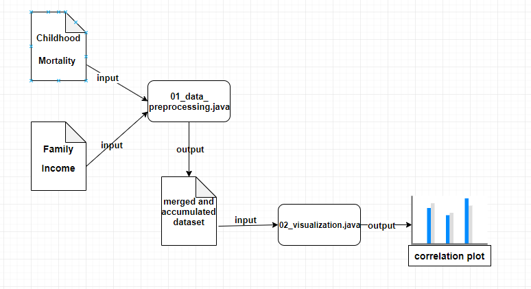

# The relationship between family income in the United States and child mortality
## Table of contents
* [General info](#general-info)
* [Technologies](#technologies)
* [Prerequisites](#Prerequisites)
* [Sources](#Sources)
* [contact](#contact)
* [Running_the_code](#Running_the_code)
* [Other_information](#Other_information)
* [Architecture](#Architecture)
## General info
This study aims to explore the relationship between family income and the rate of child mortality in the United States.
 
## Technologies
Project is created with:
* The language of Java: jdk1.8.0_151
* Netbeans program: IDE 8.2
* javafx library 
* java library 
## Prerequisites
Prior to running the experiment make sure that the following folders exist:
* `data/raw`- Folder to store raw data sets
* `data / Process`- A folder to store the processed data set
* `Reports / Numbers`- The folder contains a picture of the relationship
 ## Sources
The resulting relationship is the integration of a two-dataset:
https://catalog.data.gov/dataset/childhood-mortality-rates-by-age-at-death-united-states-1900-2013
and https://www.kaggle.com/census/real-mean-family-and-personal-income-in-the-us#real-mean-family-income-in-the-united-states.csv
## contact
You can contact the author by email rameatalah@gmail.com
## Running_the_code
To run the code in this repository, you'll need to access a device running java (at least IDE version 8.2).
Once the code is run on the program, the two data set will be taken and the relationship will be drawn. It will be drawn with a separate file that will appear on the screen and there is a picture of the output that will produce an item attached to the image file
## Other_information
Data licenses that are the Creative Commons Attribution-ShareAlike (CC-BY-SA) License
 and The code is open source
 ## Architecture
 
